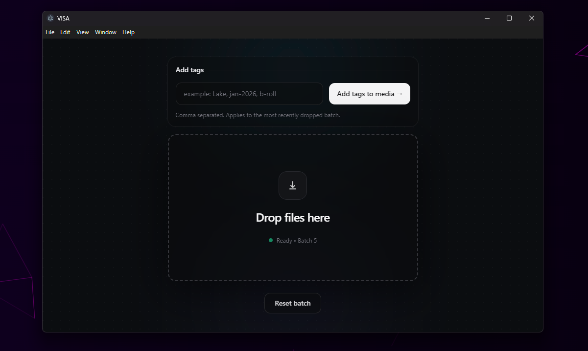
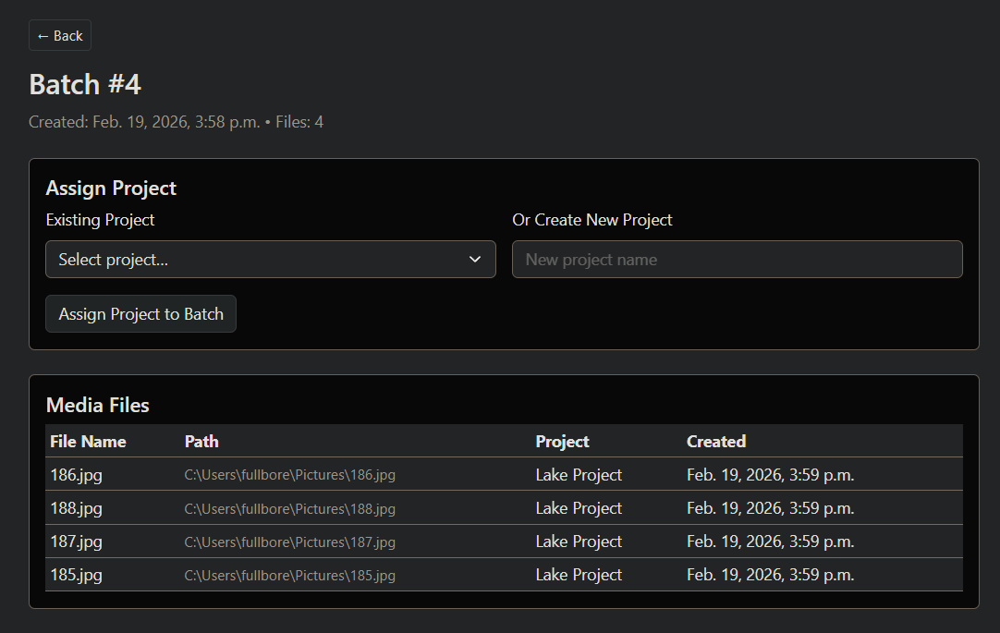

# Desktop App


# Web Dashboard


## Using AI to help with models, fixtures, and basic tests

When working on this project, you can paste a model or a small group of related models into an AI tool and ask it to help generate sample fixtures or starter tests.

A good workflow is:

1. Copy only the relevant model code, not the whole project.
2. Include any important notes about relationships or business rules.
3. Ask for either:
   - Django fixture examples
   - model test cases
   - view/API test cases
   - factory or seed data ideas

Keep your request focused. Smaller chunks usually get better results.

### Example prompt for fixtures

Here is a Django model from my project. Generate 3 realistic fixture records for it in JSON fixture format for Django loaddata. Use sensible fake values and respect foreign keys. If another model is required, include minimal related fixture rows too.

[paste model here]

### Example prompt for tests

Here is a Django model from my project. Generate basic Django tests for it using TestCase. Cover:
- object creation
- string representation
- required vs optional fields
- one relationship test if applicable

Only return the test code.

[paste model here]

### Example prompt for multiple related models

Here are related Django models from my project. Generate:
1. a small set of Django JSON fixtures
2. a basic tests.py file using Django TestCase
3. short notes on anything that looks risky or worth validating

[paste models here]

### What to include with your prompt

AI works better if you also include:
- whether the app uses Django's default `User` model or a custom one
- whether fields are nullable or unique for a business reason
- any expected naming conventions
- whether you want fixtures, unit tests, integration tests, or all three

### What to check before committing AI output

Do not blindly trust generated code. Always review for:

- wrong field names
- wrong related names
- incorrect assumptions about null/blank
- fake foreign keys that do not match your fixture records
- tests that import models from the wrong app
- use of libraries we are not using

### Recommended student workflow

1. Make or update the model by hand.
2. Run `makemigrations` and `migrate`.
3. Paste the model into AI and ask for starter fixtures or tests.
4. Clean up the output so it matches the actual app.
5. Run the tests locally.
6. Commit only reviewed code.

### Example README-safe note

AI is allowed as a helper for boilerplate, fixtures, and test scaffolding, but students are still responsible for understanding and validating all generated code before submitting it.


# todo notes
- [ ] Make sure users get tied to clients and tags they create 

# 🚀 Getting Started

This project uses **Poetry** for dependency management and virtual environments, and **Django** as the web framework.

Follow the steps below to get up and running.

---

# 📦 Install Poetry

## Install Poetry (if not installed)

### macOS / Linux / WSL
```bash
curl -sSL https://install.python-poetry.org | python3 -
```

### Windows (PowerShell)
```powershell
(Invoke-WebRequest -Uri https://install.python-poetry.org -UseBasicParsing).Content | py -
```


---

# 🔌 Install Poetry Shell Plugin

Poetry 2+ does **not** include `poetry shell` by default.  
We use it to enter the virtual environment.

```bash
poetry self add poetry-plugin-shell
```


---

# 🐍 Install Project Dependencies

From the project root:

```bash
poetry install
```

This installs all dependencies from `pyproject.toml`.

---

# ⚡ Enter the Virtual Environment

We only use **poetry shell** to activate the environment.

```bash
poetry shell
```

Once inside, you can run Python and Django commands normally:

```bash
python
pip
python manage.py ...
```

To exit:

```bash
exit
```

---

# 🛠 Django Setup

## Run Database Migrations

```bash
python manage.py migrate
```

---

## Create New Migrations (after model changes)

```bash
python manage.py makemigrations
```

Then apply them:

```bash
python manage.py migrate
```

---

## Run Development Server

```bash
python manage.py runserver
```

Default server:

```
http://127.0.0.1:8000
```

---

## Create Superuser (Admin Login)

```bash
python manage.py createsuperuser
```

Admin panel:

```
http://127.0.0.1:8000/admin
```

---

# 📁 Typical First-Time Setup Flow

```bash
poetry install
poetry shell
python manage.py migrate
python manage.py runserver
```

---

# ✅ Environment Rules for This Project

- Always work inside `poetry shell`
- Never run Django outside the virtual environment
- Dependencies must be added through Poetry

Add a package:

```bash
poetry add package_name
```

Dev dependency:

```bash
poetry add -D package_name
```

---

---

# 🖥 Electron Desktop App (VISA Uploader)

This project includes a local **Electron desktop application** used for ingesting file paths into the Django API.

The Electron app is intentionally simple:

- Drag and drop files
- Create a batch
- Send file paths to Django
- Optionally add tags to the batch
- Reset batch session

No files are uploaded — only local file paths.

## 📁 Location

```bash
electron_app/
```

---

# ⚡ Run Electron App (Development)

Open a new terminal and run:

```bash
cd electron_app
npm install
npm start
```

This launches the VISA uploader window.

## Windows quick-start scripts

From the repo root you can use:

```powershell
powershell -ExecutionPolicy Bypass -File .\scripts\start-django.ps1
```

```powershell
powershell -ExecutionPolicy Bypass -File .\scripts\start-electron.ps1
```

```powershell
powershell -ExecutionPolicy Bypass -File .\scripts\start-visa.ps1
```

`start-django.ps1` runs Django with the local `.venv`, `start-electron.ps1` launches the uploader, and `start-visa.ps1` opens both in separate PowerShell windows.

If you want the simplest student demo flow on Windows, double-click or run:

```cmd
start-demo.cmd
```

That opens two `cmd` windows:
- one runs `poetry run python manage.py runserver`
- one runs `npm start` inside `electron_app`

---

# 🔗 Electron ↔ Django Requirements

The Django server **must be running** before starting the Electron app.

```bash
python manage.py runserver
```

Default API endpoint:

```plaintext
http://127.0.0.1:8000
```

Electron communicates with Django via:

```plaintext
POST /api/batches/ensure/   → create/reset batch
POST /api/media_files/      → send file paths + tags
```

---

# 📦 Electron Dependencies

Electron dependencies are managed separately from Python dependencies.

Install or update:

```bash
cd electron_app
npm install
```

Electron packages are **not managed by Poetry**.

---

# 🧠 Development Notes

- Electron stores the current batch in memory
- Batch resets when the app reloads or reset button is pressed
- Django handles all persistence

